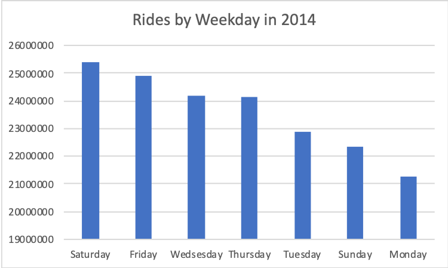
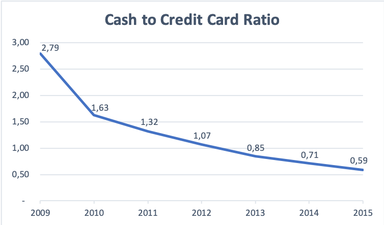
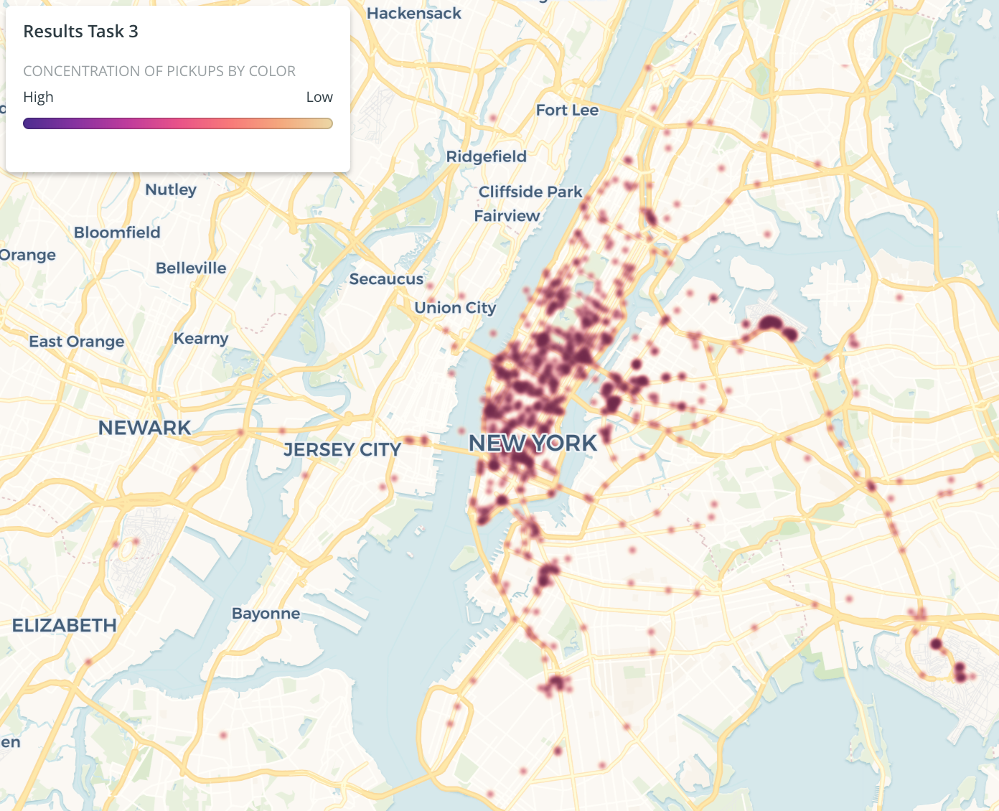
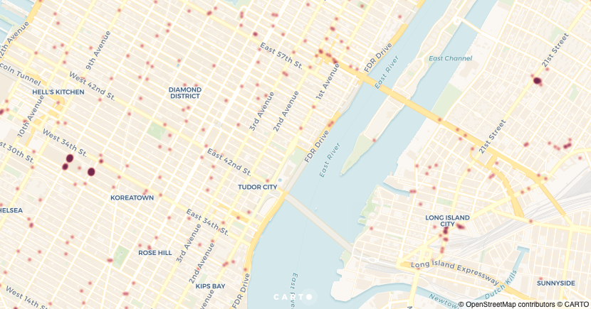

# Unacast work sample - Lars Folkestad

## Question 1: What day of week has the most rides in 2014?

### SQL query
[unacast_task1](https://bigquery.cloud.google.com/savedquery/754809503548:2489d84203df4acba447d9af0b0706c4)


```sql
#What day of the week has the most rides in 2014?
#Count trips started in 2014 as 2014 rides
SELECT
CASE EXTRACT(DAYOFWEEK FROM pickup_datetime)
  WHEN 1 THEN 'Sunday'
  WHEN 2 THEN 'Monday'
  WHEN 3 THEN 'Tuesday'
  WHEN 4 THEN 'Wedsesday'
  WHEN 5 THEN 'Thursday'
  WHEN 6 THEN 'Friday'
  WHEN 7 THEN 'Saturday'
END
AS Weekday
, COUNT(pickup_datetime) as RidesCount
FROM (
  SELECT pickup_datetime FROM `nyc-tlc.yellow.trips`
  WHERE EXTRACT(YEAR FROM pickup_datetime) = 2014
  )
GROUP BY weekday
ORDER BY RidesCount DESC;
```

### Results

From the chart we can see that Saturday is the day of the week with the most rides in 2014.



## Question 2: How has the ratio of payments in cash and by credit card developed over time?

### SQL query
[unacast_task2](https://bigquery.cloud.google.com/savedquery/909239636881:4db1826329b245f8ab85af54067c41c0)

```sql
#How has the ratio of payments in cash and by credit card developed over time?

SELECT
#defined year of payment as year of dropoff, taking NYE into consideration
  EXTRACT(YEAR FROM dropoff_datetime) AS Year
  ,SUM(Case When payment_type = 'CSH' Then 1 Else 0 End )
  /SUM(Case When payment_type = 'CRD' Then 1 Else 0 End ) * 1.0 AS CashCreditRatio
FROM `nyc-tlc.yellow.trips`
#added because there was erroneous data points outside this range
#that caused zero division errors
WHERE EXTRACT(YEAR FROM dropoff_datetime) BETWEEN 2009 AND 2015
GROUP BY Year
ORDER BY Year ASC;
```

### Results

The chart shows an apparent decreasing trend in the use of cash compared to the use of credit card from 2009 to 2015.



## Question 3: What is the most popular area to be picked up in 2014, disregarding airports?
Decimal coordinates are retreived from https://www.latlong.net/.
Through exploration I found that it was not possible to exclude airports by not including the rate codes two and three, JFK and Newark. LaGuardia was also not included in the rate codes. Moreover, a ride started in e.g. Manhattan could also have rate code = 2 (JFK) because it was heading to JFK.

### SQL query
[unacast_task3](https://bigquery.cloud.google.com/savedquery/909239636881:3b11c885f0f0482db11c2666e267aa7f)
```sql
#What is the most popular area to be picked up in 2014, disregarding airports?

SELECT pickup_latitude, pickup_longitude, COUNT(*) AS num_trips
FROM `nyc-tlc.yellow.trips`
WHERE
  #Erroneus points in data
  NOT (pickup_latitude = 0.0 OR pickup_longitude = 0.0)
  #Approximate borders of New York metropolitan area
  AND (pickup_latitude >= 40.5 AND pickup_latitude <= 41.0)
  AND (pickup_longitude >= -74.2 AND pickup_longitude <= -73.7)
  AND EXTRACT(YEAR FROM pickup_datetime) = 2014
GROUP BY pickup_latitude, pickup_longitude
ORDER BY num_trips DESC
LIMIT 10000
```
### Results
As I was not able to remove the airports in my SQL query, the conclusions are drawn solely from the weighted heatmap created with [Carto](https://carto.com/) using the result data from my query.
From the below map it is evident that the most popular area to be picked up in 2014 is in the Manhattan bourough, but also the western parts of Queens and Brooklyn have high concentrations of pickups.



Zooming in, it seems like the area around Madison Square Garden in Manhattan is the most popular area to be picked up, when looking at the concentration around a small area.


